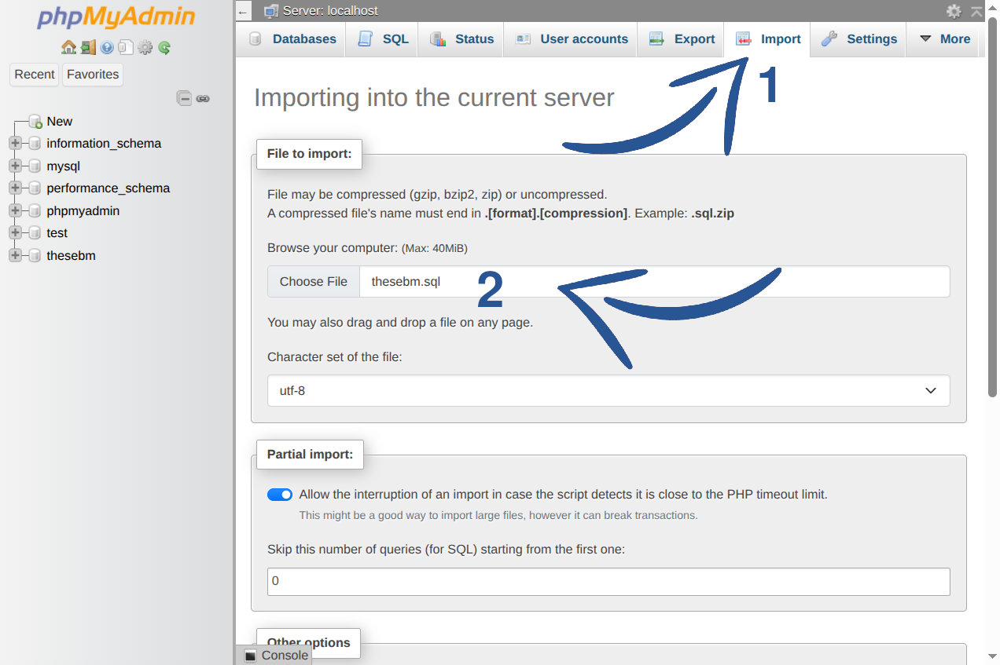
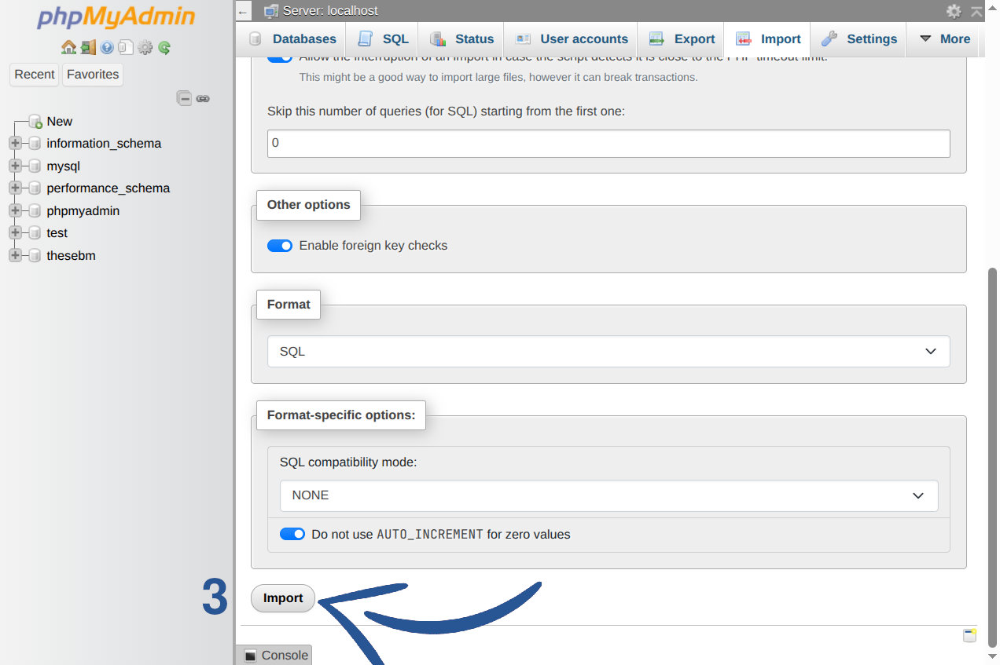

# TheseBM

## Table of Contents

- [Getting Started](#getting-started)
- [Importing Database in PHPMyAdmin](#importing-database-in-phpmyadmin)
- [Features](#features)

---

## Getting Started

To begin development, install [XAMPP](https://www.apachefriends.org/download.html) and copy the repository to the root folder.

### Windows

```bash
git clone git@github.com:Zorbiks/TheseBM.git C:/xampp/htdocs/TheseBM
```

### GNU/Linux

```bash
git clone git@github.com:Zorbiks/TheseBM.git
```

**Note:** On GNU/Linux, ensure you change the `DocumentRoot` option in the file located at `/opt/lampp/etc/httpd.conf` to a different directory. This avoids the need for root permissions.

**Example:**

```apache
DocumentRoot "/home/user/www"
<Directory "/home/user/www">
```

---

## Importing Database in PHPMyAdmin

1. Open ```http://localhost/phpmyadmin/``` in your browser.
2. Navigate to the **Import** tab.
3. In the **File to import:** section, click **Choose File** and select the ```thesebm.sql``` file.



4. Scroll down to the bottom of the page and click the **Import** button.



---

## Features

Features for professor's account
- Add, edit, or delete doctoral student accounts
- Download attestations, publications, and reports
- View publications directly in the browser
- Access a dashboard with statistics and journal entries
- Approve or reject new account registration requests
- Download multiple publications in bulk
- Export the publications table in CSV format
- Search across all publications

Features for doctoral student's account
- Add, edit or delete a publication
- Search their own publications only

